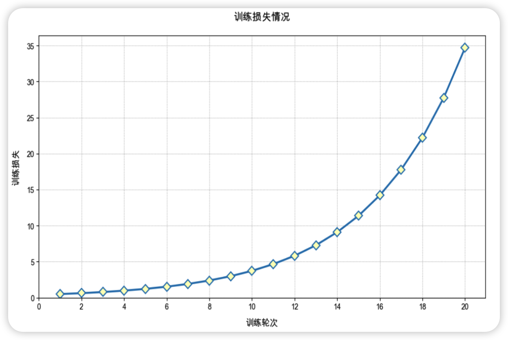

# 阿里云 ACP 官方 20 道模拟题详解整理

这份笔记在保留原题核心考点的基础上，统一补充为“专题讲义版”，适合考前复习和知识体系梳理。  
建议复习顺序：

1. 先看每题的“核心概念”和“为什么选它”。
2. 再看“其他选项为什么错”，建立排除法思维。
3. 最后结合文末“知识地图”和“高频易错点”做整体串联。

---

## 第 1 题（单选）

**1. 分词（Tokenization）的主要作用是什么？**

- A. 将文本转换为固定长度的向量
- B. ✅ 将输入文本分割成单词、子词或字符等更小的语义单元
- C. 提取文本的语义特征以计算情感值
- D. 为模型提供上下文信息

**正确答案：B**

**核心概念：**

- 分词是大模型处理自然语言的第一步。
- 模型并不是直接“看懂”一句自然语言，而是先把文本切成一个个 `Token`。
- `Token` 不一定等于“一个汉字”或“一个单词”，它可能是字、词、子词、标点、空格的一部分。
- 对中文来说，常见情况是一个汉字可能对应一个或多个 `Token`；对英文来说，一个单词也可能被拆成多个子词。

**为什么选 B：**

- 分词的本质就是把原始文本切分成模型可以处理的离散符号单元。
- 只有先完成分词，模型后续才能进行向量化、注意力计算、概率预测等步骤。

**其他选项为什么错：**

- A 错在把“分词”和“向量化”混为一谈。文本转向量是后续的 `Embedding` / 表示学习阶段，不是分词本身。
- C 错在把分词当成“语义分析”步骤。分词只是预处理，不等于已经完成情感分析或语义理解。
- D 不够准确。上下文信息来自整段输入和模型的上下文窗口，不是分词单独提供的。

**延伸知识：大模型处理文本的典型流程**

1. 文本输入
2. 分词 Tokenization
3. Token 映射为 ID
4. ID 转向量 Embedding
5. 经过 Transformer 多层计算
6. 预测下一个 Token 的概率分布
7. 采样或选取得到输出

**常见误区：**

- 误区 1：一个 Token 就是一个单词。实际上常常不是。
- 误区 2：分词后模型就“理解”文本了。真正的语义建模发生在后续网络计算中。
- 误区 3：上下文长度按“字数”算。很多平台是按 Token 计费和限制上下文。

**实战启发：**

- 做提示词工程时，长文本成本高，本质上就是 Token 成本高。
- 做 RAG 时，文档切片质量、标题结构、术语格式都会影响分词效果和后续向量表示效果。

---

## 第 2 题（单选）

**2. 你所在的医院技术部正在翻译一份医学影像技术手册，包含上千条内部非公开的专业术语与缩写。如果想在翻译时保证准确性，并减少对大量示例的依赖，以下哪种做法更合适？**

- A. 仅提供少量缩写翻译示例。如 "MRI → 磁共振成像"，"CT → 计算机断层扫描"，让大模型依照模仿。
- B. 分配"专业医学翻译员"角色，依靠零样本提示直接解决
- ✅ **C. 接入专业术语库，并使用 RAG 技术，以动态查询并统一术语标准**
- D. 尽可能增加示例数量，用穷举方式涵盖所有缩写的翻译场景。

**正确答案：C**

**核心概念：**

- 这道题考的是 `Prompt`、`Few-shot`、`RAG` 三种能力边界。
- 当知识是大量、专业、私有、动态变化的内容时，单靠提示词和少量示例往往不稳定。
- RAG 的价值在于：不把所有知识硬塞进 Prompt，而是在需要时从外部知识库检索出相关内容，再让模型基于检索结果生成答案。

**为什么选 C：**

- 医学术语多、专业性强、内部非公开，天然适合放进专业术语库。
- 翻译时动态检索术语库，能保证：
  - 翻译一致
  - 专业术语准确
  - 不依赖大量示例
  - 术语更新时不必重新微调模型

**其他选项为什么错：**

- A 只给少量样例，覆盖面远远不够。模型可能模仿格式，但无法保证海量术语都翻译正确。
- B “设定角色”只能轻微改善输出风格，不能替代真实知识来源。
- D 用穷举示例的方式成本极高，也难维护，而且上下文窗口有限。

**什么时候优先选 RAG：**

- 知识是私有数据
- 知识量大，不能全部写进提示词
- 知识会变化，需要及时更新
- 结果要求一致、可追溯

**RAG 与微调的区别：**

- RAG：把知识放在外部库里，运行时检索。
- 微调：把任务偏好或模式学进模型参数里。
- 本题重点是“非公开术语 + 准确翻译 + 减少示例依赖”，明显更像知识检索问题，不是参数适配问题。

易混淆点： RAG 适合知识更新频繁的场景，但前提是知识库和索引能够及时同步；如果业务要求的是“绝对实时”的最新数据，如库存、价格、订单状态，则应优先使用 API 或数据库实时查询，而不是只依赖 RAG。

**实战启发：**

- 企业术语表、产品规格表、法律条文、医院内部标准、组织架构表等，都很适合用 RAG 管理。
- 最佳实践往往是“术语库 + 检索 + 模板化输出”，而不是“堆样例”。

---

## 第 3 题（单选）

**3. 假设你正在使用大模型解决以下数学问题："小明每天存入银行 10 元钱，但每周末（周六和周日）会取出 20 元用于消费。如果小明从某周一（第一天）开始存钱，请问小明需要多少天才能存够 100 元？"为了提升大模型解答此类问题的准确率，以下哪种提示方法最能有效引导大模型生成正确的答案？**

- A. 提供少量样例
- B. 明确输出要求
- ✅ **C. 思维链方法**
- D. 提供受众和角色

**正确答案：C**

**核心概念：**

- 思维链（Chain-of-Thought, CoT）是一种引导模型按步骤推理的方法。
- 对数学题、逻辑题、多条件判断题、流程分析题，分步推理通常比直接要答案更可靠。

**为什么选 C：**

- 题目中同时包含“每天存入”和“周末取出”的周期性规则，属于需要逐步分析的推理题。
- 思维链可以让模型先拆分问题，再按时间轴计算，更容易减少遗漏和逻辑跳步。

**其他选项为什么错：**

- A 少量样例有帮助，但不如直接要求分步推理更针对。
- B 明确输出格式只能约束答案外形，不能显著提升复杂推理质量。
- D 角色设定主要影响语气和表达视角，不是推理增强的关键手段。

**思维链适合哪些题：**

- 数学应用题
- 条件判断题
- 计划拆解题
- 多步计算题
- 因果分析题

**但要注意：**

- CoT 不是万能的。如果底层模型推理能力弱，分步写出来也可能是错的。
- 某些高风险场景更适合“让模型先分析，再调用工具计算”，例如计算器、代码执行器、数据库查询。

**实战启发：**

- 提示词可写成：
  - “请一步一步推理，再给出最终答案”
  - “先列出已知条件，再逐步计算”
  - “先给中间过程，最后单独输出结论”

**常见误区：**

- 误区 1：所有任务都上 CoT。简单问答没必要，反而增加成本和延迟。
- 误区 2：CoT 等于正确答案。它只是提高概率，不保证绝对正确。

---

## 第 4 题（单选）

**4. 你为教育公司搭建了 RAG 问答系统，且知识库存储了各部门的机密数据（如财务部的薪资表、教务部的未公开课件）。为了确保普通员工只能访问自己有权限的数据，以下哪种做法最合适？**

- A. 预处理用户问题时强制添加"请仅回答我部门数据"的提示词
- B. 对大模型进行微调使其主动拒绝跨部门问题
- C. 为每个用户单独生成加密密钥用于访问知识库
- ✅ **D. 在检索知识库时，动态筛选出用户有权限访问的文档。**

**正确答案：D**

**核心概念：**

- 这道题考 RAG 安全中的“检索前权限控制”。
- 企业知识库安全的关键原则不是“生成阶段让模型自己克制”，而是“在检索阶段就不让无权限数据进入上下文”。

**为什么选 D：**

- RAG 的回答基于召回文档生成。
- 如果无权限文档根本不被检索出来，模型就无法基于这些内容作答，风险最小。
- 这属于典型的“基于身份、角色、部门、标签的文档过滤”。

**其他选项为什么错：**

- A 只靠提示词属于软约束，不能作为权限系统。
- B 微调不能替代访问控制，模型仍可能在边界场景泄露信息。
- C 加密密钥是存储安全的一部分，但题目核心是“谁能检索到什么文档”，不是单纯加密。

**企业级 RAG 权限控制常见做法：**

- 文档入库时打标签：部门、角色、密级、时间范围、项目归属
- 用户登录后带上身份信息
- 检索时动态附加过滤条件
- 审计用户查询日志与返回结果

**一条非常重要的原则：**

- 安全不要只做在模型层，要做在数据层、检索层、接口层、审计层。

**实战启发：**

- 如果公司有财务、法务、人事、研发等多部门知识库，最稳妥的方式是“权限过滤 + 检索 + 生成”，而不是只提示模型“不要回答”。

---

## 第 5 题（单选）

**5. 在测试 RAG 应用性能时，你发现检索阶段总是出现不太相关的段落。为了提高检索准确度，你应该怎么做？**

- A. 尝试增加大模型重复惩罚系数，避免召回不相关内容
- B. 尝试使用领域相关知识微调大模型，让其能更好的识别相关段落
- ✅ **C. 尝试调整 embedding 模型、并使用重排（rerank）**
- D. 尝试减少模型推理温度

> ⚠️ 注意：截图中原标注的选中项为 **A**，但从技术原理看，**正确答案应为 C**。

**正确答案：C**

**核心概念：**

- RAG 一般分为：
  - 文档解析
  - 切片 Chunking
  - 向量化 Embedding
  - 检索 Recall
  - 重排 Rerank
  - 生成 Answering
- 如果“检索阶段召回不相关段落”，应该优先优化检索链路，而不是生成参数。

**为什么选 C：**

- `Embedding` 模型决定文本如何被映射到向量空间。
- 如果向量表示不够适合当前领域，相关文本在向量空间里可能离得并不近。
- `Rerank` 会对初步召回结果进行二次排序，通常能显著提高前几条结果的相关性。

**术语严谨性说明：**

- 严格来说，`Recall`（初步检索）和 `Rerank`（重排）是两个不同步骤。
- 如果按狭义定义理解，“检索阶段”更偏向先从大量文档里召回一批候选结果；而 `Rerank` 是对候选结果再做精排。
- 但在很多工程语境里，大家会把 `Recall + Rerank` 一起视为“检索链路”或“检索模块优化”。
- 所以这道题虽然题干写的是“检索阶段”，表述不算特别严谨，但它真正想考的是：当相关段落找得不准时，应该优先优化检索链路，而不是去调生成参数。
- 因此，`Embedding + Rerank` 依然是四个选项里最合理的方向。

**Embedding 到底是什么：**

- 可以把 `Embedding` 理解成：把一句话、一个段落、一个词，转换成一串能表示语义特征的数字坐标。
- 这些数字组成的向量，本质上是在告诉系统：“这段文本和哪些文本在语义上更接近”。
- 例如，“退款流程怎么走”和“如何申请退款”表面文字不完全一样，但好的 `Embedding` 模型会把它们映射到彼此较近的位置。
- 反过来，如果 `Embedding` 模型不适合当前领域，比如面对医学、法律、企业内部术语时表达能力不足，那么真正相关的文本在向量空间里可能并不靠近，检索效果就会变差。

**你可以这样记：**

- `Embedding` 决定“文本在向量空间里站在哪儿”。
- `Recall` 决定“先把哪些候选人叫进来”。
- `Rerank` 决定“再把这些候选人重新排个名次”。
- 如果第一步站位就不对，后面再怎么排，也很难排出最相关结果。

**零基础版理解：Embedding、向量、相似度、Rerank 到底是什么关系**

- 可以把整个过程想象成“先在地图上找附近的人，再重新排队”。
- `Embedding` 就像把一句话翻译成地图坐标。这个坐标不是二维点，而是一长串数字，所以也叫“向量”。
- 有了向量之后，系统就可以比较两段文本在“语义地图”上离得近不近。离得越近，通常说明意思越像，这就是相似度的基本思路。
- 例如，“如何申请退款”和“退款流程怎么走”字面不一样，但语义很接近。好的 `Embedding` 模型会把它们放在比较近的位置。
- `Recall` 的作用是先从大量文档里，粗略找出一批看起来最接近的问题候选段落。
- `Rerank` 的作用是对这批候选结果再做一次更精细的排序，把最可能真正有用的内容排到前面。

**用一句最直白的话来记：**

- `Embedding`：把文本变成数字坐标
- 向量：这组数字坐标本身
- 相似度：看两个坐标离得近不近
- `Recall`：先粗找一批候选
- `Rerank`：再把候选重新排好顺序

**为什么第 5 题先提 Embedding：**

- 因为如果文本一开始就没有被映射到合适的位置，那么真正相关的段落可能根本不会进入候选列表。
- 这就像地图标错位置一样，后面即使再认真排队，也排不出真正最近的人。
- 所以 `Embedding` 决定“找不找得到”，`Rerank` 更偏向决定“找到以后排得准不准”。

**其他选项为什么错：**

- A 重复惩罚系数作用于生成阶段，影响输出文本的重复度，不影响检索。
- B 微调大模型主要提升生成或任务适配，不直接解决检索器召回质量。
- D 温度影响输出随机性，也属于生成阶段参数。

**RAG 检索质量优化顺序建议：**

1. 先检查文档解析是否保留结构
2. 再检查切片策略是否合理
3. 调整 `Embedding` 模型
4. 增加 `Rerank`
5. 调整检索参数，如 `Top K`、阈值
6. 最后再考虑 Query Rewrite、多路召回等增强策略

**什么时候尤其需要 Rerank：**

- 原始召回较宽泛
- 文档很多且内容相似
- 需要把最相关的前 3 到前 5 条结果排在最前面

**常见误区：**

- 把“生成效果不好”误以为是“检索不好”
- 调一堆温度、top_p、重复惩罚，却不看检索链路

---

## 第 6 题（单选）

**6. 你在开发一个基于 RAG 的智能客服系统，用于回答用户关于产品功能的技术问题。为了提升回答的准确性，你调整了检索模块的相似度阈值，从默认的 0.7 提高到了 0.95。然而，测试后发现，部分用户的提问得不到满意的回答。可能的原因是什么？**

- A. 检索模块的计算复杂度增加，导致大模型推理速度变慢
- B. 用户提问的语言风格与产品文档内容不一致，导致检索失败
- ✅ **C. 回答准确但不全面，因为过于严格的检索条件过滤掉了部分有用的上下文信息**
- D. 系统成功过滤掉了所有无用数据，回答的准确性和完整度都得到了显著提升

**正确答案：C**

**核心概念：**

- 相似度阈值越高，进入候选结果的文本越“像”查询。
- 但阈值过高会导致许多“有用但表达不完全一致”的内容被过滤掉。

**为什么选 C：**

- RAG 不是只追求“最像”，还要兼顾“够全”。
- 技术问题的答案往往分散在多个段落中，阈值太高可能导致上下文片段不足，最终生成内容不完整。

**其他选项为什么错：**

- A 阈值提高不是导致回答不满意的核心原因，重点在召回不足。
- B 有时确实会发生，但题目明确说你改的是“阈值”，因此最直接原因是检索过严。
- D 过于理想化，实际常见结果是精度可能提高一点，但召回明显下降。

**这一题的本质：Precision 与 Recall 的权衡**

- 阈值高：
  - 可能提高精确率
  - 容易降低召回率
- 阈值低：
  - 可能提高召回率
  - 也可能引入噪声

**实战建议：**

- 不要盲目把阈值调得很高。
- 更推荐通过以下组合优化：
  - 合适的 `Top K`
  - 更好的 `Embedding`
  - `Rerank`
  - Query Rewrite

---

## 第 7 题（单选）

**7. 某 RAG 系统回答"张伟是哪个部门的"时，总是只检索到一个无关切片，导致答案不准确。为改进检索效果，下列哪种做法有助于改善这个问题？**

- A. 换用更大参数量的大模型
- ✅ **B. 提高检索时的召回数量（Top K）**
- C. 放弃知识库，全部"对话式"推理
- D. 修改前端界面外观

**正确答案：B**

**核心概念：**

- `Top K` 表示从检索器中取回前 K 条候选结果。
- 如果 K 太小，系统可能只拿到一个错误或次优切片，从而错过真正相关内容。

**为什么选 B：**

- 人名、组织名、职位名等实体问题，常常因为文档切片、别名、上下文不完整而出现召回偏差。
- 适度提高 `Top K`，可以扩大候选范围，为后续重排或生成提供更多有效上下文。

**其他选项为什么错：**

- A 更大的生成模型不能替代检索缺失。
- C 放弃知识库意味着失去事实来源，风险更大。
- D 前端外观与检索准确度无关。

**Top K 该怎么理解：**

- 太小：容易漏召回
- 太大：容易引入噪声，增加成本
- 最佳值依赖文档质量、切片策略、Rerank 能力

**实战启发：**

- 一般不是单独调整 `Top K`，而是组合使用：
  - 增大 `Top K` 做初召回
  - 用 `Rerank` 精排
  - 再把前若干条送给大模型

---

## 第 8 题（单选）

**8. 你在优化 RAG 应用时，检索条件变得非常宽松，相似度很低的文本段也可以被召回。这可能会导致出现以下哪种情况？**

- ✅ **A. Context Recall（文本段召回率）变高**
- B. Context Recall（文本段召回率）变低
- C. Context Recall（文本段召回率）基本不变
- D. 文本段精度变高

**正确答案：A**

**核心概念：**

- `Context Recall` 关注的是“该召回到的相关文本有没有被召回到”。
- 检索条件宽松，意味着更多候选文本会进入结果集，其中包含相关文本的概率通常上升，所以召回率会提升。

**为什么选 A：**

- 相似度要求变低后，一些原本被排除的边缘相关文本也能被拿回来。
- 这对“找全信息”有帮助，因此 `Recall` 往往会上升。

**为什么 D 错：**

- 宽松检索通常会引入更多无关内容，因此精确率更可能下降，而不是上升。

**Recall 和 Precision 的关系：**

- Recall 高：找得全
- Precision 高：找得准
- 两者往往存在权衡，系统优化的难点就在这里

**实战启发：**

- 对问答系统来说，先粗召回再重排，通常比一开始就卡得很死更稳妥。

---

## 第 9 题（单选）

**9. 你将 PDF 文档转成普通文本后，RAG 的检索质量变差。下列哪种做法最能提升检索准确度？**

- ✅ **A. 将文本转成更结构清晰的 Markdown**
- B. 提前把文档压缩成 ZIP 再索引
- C. 调整大模型输出温度（temperature）
- D. 用正则表达式彻底删除停用词

**正确答案：A**

**核心概念：**

- 文档解析质量会直接影响 RAG 的下游检索质量。
- PDF 转纯文本时，常常丢失标题层级、列表结构、表格边界、段落关系。
- Markdown 能较好保留“结构化语义”。

**为什么选 A：**

- 标题、子标题、列表、引用、表格、代码块等结构信息，本身就是重要语义线索。
- 保留这些结构，更利于后续切片、向量化和检索。

**其他选项为什么错：**

- B 压缩成 ZIP 不会提升语义质量，反而无法直接索引。
- C 温度属于生成参数，不解决文档结构损失问题。
- D 粗暴删停用词可能破坏句意，现代语义检索一般也不依赖这种简单做法。

**文档预处理优先级：**

1. 保留结构
2. 保留标题与章节层级
3. 正确处理表格
4. 去掉噪音页眉页脚
5. 维持段落语义完整

**实战启发：**

- 对 PPT、PDF、Word、网页类文档，不要只追求“能转成文本”，更要追求“保留结构和语义关系”。

---

## 第 10 题（单选）

**10. 你在开发一个可以自动回答客户问题的客服平台。除了回答产品知识问题外，你希望它还能执行与账户相关的操作（例如实时查询用户订单状态、修改账户绑定的手机号、提交工单或退款申请）。你应该考虑引入什么技术来扩展大模型的能力？**

- A. RAG（Retrieval Augmented Generation）
- ✅ **B. Agent（智能体）**
- C. 大模型微调
- D. 数据增强

**正确答案：B**

**核心概念：**

- RAG 解决的是“知道什么”。
- Agent 解决的是“能做什么”。
- 当系统不仅要回答问题，还要调用外部系统执行操作，就进入了 Agent 范畴。

**为什么选 B：**

- 查询订单状态、改手机号、提工单、申请退款，本质上都需要访问业务系统或调用 API。
- Agent 可以根据任务规划步骤，并调用工具完成实际动作。

**其他选项为什么错：**

- A RAG 只能增强知识获取，不负责执行账户操作。
- C 微调可以提升风格或任务表现，但不能天然获得系统操作权限。
- D 数据增强是训练数据策略，不是能力执行框架。

**Agent 的典型能力：**

- 工具调用
- 任务规划
- 多轮状态管理
- 条件判断
- 调用外部接口并返回结果

**实战启发：**

- 判断该用 RAG 还是 Agent 的一个简单问题是：
  - 如果只是问“产品保修期多久”，偏 RAG。
  - 如果是“帮我查一下我的订单在哪”，偏 Agent。

---

## 第 11 题（单选）

**11. 你开发智能会议助手时遇到技术选型问题，"需要将会议录音转换为文字记录，并自动生成带有重点标注的摘要，最后将摘要内容转换为语音播报"。以下技术组合中最合理的是？**

- A. cosyvoice-v1 语音合成 → Qwen-VL 视频理解 → ComfyUI 文生图
- ✅ **B. 语音转文本服务 → 文本生成模型 → cosyvoice-v1 语音合成**
- C. MoviePy 视频剪辑 → 文本生成模型 → ComfyUI 生成摘要图表
- D. Qwen-VL 分析会议录像 → MoviePy 添加字幕 → 文本生成摘要

**正确答案：B**

**核心概念：**

- 题目考的是多模态处理链路设计。
- 输入是语音，输出仍然是语音，但中间需要进行文本理解与摘要生成。

**为什么选 B：**

1. 先把会议录音转成文本
2. 再用文本生成模型提炼摘要、重点事项、待办项
3. 最后再把摘要转回语音播报

这条链路完整且合理。

**其他选项为什么错：**

- A 一上来就做语音合成，方向反了。
- C 视频剪辑和文生图都不是本题核心。
- D 会议录音的核心需求是语音转写，不是优先做视频理解。

**多模态系统设计常识：**

- 先判断输入模态
- 再判断中间是否需要统一到文本
- 最后看输出模态

**实战启发：**

- 很多多模态应用最后都会把复杂理解阶段落在文本上，因为文本便于结构化、摘要、检索、审计和二次加工。

---

## 第 12 题（单选）

**12. 你是某金融 APP 的智能投顾系统负责人，发现用户存在恶意咨询的情况，如涉及"内幕消息"等敏感词。为了在检测到敏感词时立即返回固定话术，以下哪种方案最能满足需求？**

- A. 在生成回答后追加合规性二次审核
- B. 对知识库文档进行预筛查标记
- ✅ **C. 在用户提问时启用敏感词实时检测**
- D. 通过模型微调降低风险话题生成概率

**正确答案：C**

**核心概念：**

- 这道题考“前置安全拦截”。
- 对高风险场景，最稳妥的方式不是“生成后再纠错”，而是“进入模型前就识别并拦截”。

**为什么选 C：**

- 用户一输入敏感内容就触发规则，可以立刻返回固定话术。
- 这样可以避免模型已经生成了违规或高风险内容。

**其他选项为什么错：**

- A 生成后审核有延迟，而且已经存在内容泄露风险。
- B 文档预筛查是知识库治理，不是对用户恶意输入的实时响应。
- D 微调只能降低概率，不能满足“立即返回固定话术”的强约束。

**常见安全拦截层次：**

- 输入前置检测
- 检索结果过滤
- 生成结果审核
- 审计日志与告警

**适用场景：**

- 金融投顾
- 医疗咨询
- 法律合规
- 未成年人内容安全
- 企业内部敏感信息防泄露

---

## 第 13 题（单选）

**13. 模型微调最适合以下解决哪种问题？**

- A. 需要实时检索最新互联网信息的任务
- ✅ **B. 需要提升模型在特定任务的表现**
- C. 需要快速响应简单问答的任务
- D. 需要结合用户界面操作的任务

**正确答案：B**

**核心概念：**

- 微调的目的，是让模型在某类任务上表现得更符合预期。
- 它通常用于：
  - 风格适配
  - 任务适配
  - 领域适配
  - 指令遵循增强

**为什么选 B：**

- 当你已经知道任务类型明确，且有足够高质量样本，希望模型在这类任务上更稳定、更专业，微调是合适手段。

**其他选项为什么错：**

- A 最新信息应靠检索，不是靠微调。
- C 快速响应更偏工程优化、缓存、模型尺寸选择，不是微调的核心价值。
- D 结合界面操作更像 Agent 或工作流系统。

**什么时候考虑微调：**

- Prompt 已优化但仍不稳定
- 任务重复性强、样本格式稳定
- 有足够训练数据
- 希望降低提示词复杂度或推理成本

**什么时候不该先微调：**

- 知识更新特别快
- 数据量太少
- 问题本质是检索、权限、工作流或工具调用

---

## 第 14 题（单选）

**14. 下面是 qwen2.5-1.5b 微调训练过程中的损失趋势图，当前的状态是？**

> 损失趋势：从 epoch 1 到 20，训练损失从约 0.5 一路飙升至约 35，呈现指数级上升。

- A. 欠拟合
- B. 过拟合
- ✅ **C. 训练失败**
- D. 训练成功

> ⚠️ 注意：截图中原标注的选中项为 **B**，但更准确的判断应是 **C. 训练失败**。

**正确答案：C**

**核心概念：**

- `Loss` 是训练中衡量模型预测误差的指标。
- 正常训练中，训练损失通常应该总体下降，可能伴随小幅波动。
- 如果训练损失持续显著上升，往往意味着训练过程出了问题。

**为什么选 C：**

- 题目说的是训练损失本身持续暴涨。
- 这不是典型的过拟合，也不是欠拟合，而更像训练发散或训练配置错误。

**过拟合、欠拟合、训练失败的区别：**

- 欠拟合：训练集和验证集都表现差，训练损失下降有限但不一定发散。
- 过拟合：训练损失继续下降，但验证损失上升，泛化变差。
- 训练失败：训练损失异常上升、不收敛、数值发散。

**可能原因：**

- 学习率过高
- 数据格式有问题
- 标签错位
- 梯度爆炸
- 训练参数配置不合理
- 训练样本分布异常

**实战排查顺序：**

1. 检查数据格式和标签
2. 检查学习率
3. 检查是否开启梯度裁剪
4. 检查损失函数与任务是否匹配
5. 抽样查看训练样本内容

---

## 第 15 题（多选）

**15. 关于大模型的工作流程，以下哪三个描述是正确的？**

- ✅ A. 输入文本需要先分词化为 Token
- B. 只要每次输入的问题一样，每次输出的 Token 也会一样
- ✅ C. 大模型推理阶段会根据候选 Token 的概率选择输出内容
- ✅ D. Token 向量化是为了让计算机能够理解自然语言

**正确答案：A、C、D**

**核心概念：**

- 这题考的是大模型基础推理流程。

**A 为什么对：**

- 任何文本进入模型前，通常都要先分成 Token。

**B 为什么错：**

- 同样输入不一定同样输出。
- 只要推理时存在随机采样、温度不为 0、top_p/top_k 生效，结果就可能不同。
- 即使温度为 0，不同模型版本、系统提示词、上下文变化也会导致差异。

**C 为什么对：**

- 模型每一步都会预测“下一个 Token”的概率分布，再根据策略选择输出。

**D 为什么对：**

- 计算机不能直接处理自然语言字符串，需要先映射为数值向量表示。

**完整理解：**

- 文本本身不是神经网络直接操作的对象。
- 模型真正处理的是一串数字化表示，然后再根据概率逐个生成 Token。

**易错点：**

- 很多人以为“大模型一次性生成整句话”，其实通常是逐 Token 生成。

---

## 第 16 题（多选）

**16. 某公司正在开发一款智能客服系统，用于为用户提供多语言支持。在处理用户问题时，系统需要准确翻译并解释一些内部非公开的领域术语。为了确保翻译和解释的高准确性，以下哪两个方案能有效解决这一问题？**

- ✅ A. 手动整理所有术语及其翻译，并作为提示词提供给模型
- B. 要求模型在遇到未知术语时直接跳过，避免错误翻译
- C. 提供 3 条术语的翻译示例，依赖模型自行推断其余术语的含义
- ✅ D. 通过 RAG 技术接入该领域术语数据库，动态检索并翻译术语

**正确答案：A、D**

**核心概念：**

- 这题本质上是第 2 题的多选深化版，考“短期可行方案”和“长期可扩展方案”。

**A 为什么对：**

- 如果术语量可控，把术语表直接作为提示词输入，是一种简单有效的方法。
- 特别适合小规模、短期、固定场景。

**D 为什么对：**

- 当术语规模变大、更新频繁、涉及私有内容时，RAG 明显更适合。

**B 为什么错：**

- 跳过未知术语会直接降低可用性，也可能导致信息缺失。

**C 为什么错：**

- 只给少量示例让模型类推，对内部术语这类高精度任务风险很高。

**知识抽象：**

- 小规模、稳定术语：可直接放 Prompt
- 大规模、动态术语：优先 RAG

---

## 第 17 题（多选）

**17. 你要给多个未归档的 Keynote 文档创建索引，这些文档中包括表格、流程图等复杂内容。在"文档解析"环节，你可以怎么做？**

- ✅ A. 开发能解析 Keynote 的自定义 Reader
- ✅ B. 先将 Keynote 转成 PDF，再用 DashScopeParse 处理
- C. 调大 RAG 应用召回 chunk 的数量
- D. 无需任何特殊处理，直接传 Keynote 路径

**正确答案：A、B**

**核心概念：**

- 文档解析是 RAG 的上游步骤。
- 如果源文档本身没被正确提取成结构化内容，后面无论怎么调检索参数，都救不回来。

**A 为什么对：**

- 自定义 Reader 可以针对 Keynote 这种特殊格式做定制化解析，适合保留复杂结构。

**B 为什么对：**

- 转成更通用的格式再解析，是工程中很常见的折中方案。

**C 为什么错：**

- `Top K` 属于检索阶段参数，与“能不能正确解析文档”不是一个层面的问题。

**D 为什么错：**

- Keynote 并不是大多数解析器原生支持的标准文本格式，直接传路径一般不会自动得到有效文本。

**实战启发：**

- RAG 项目常见的真实问题不在模型，而在“文档进不来”或“进来以后结构全乱了”。

---

## 第 18 题（多选）

**18. 某团队计划为法律咨询场景微调一个大模型。在正式启动微调前，团队需优先评估以下哪三点？**

- ✅ A. 通过设计专业法律术语提示词优化输出结果
- ✅ B. 使用法律条文数据库构建知识检索增强生成（RAG）系统
- ✅ C. 验证现有法律案例数据量是否满足微调的数据规模要求
- D. 采购 10 块专业显卡用于本地训练

**正确答案：A、B、C**

**核心概念：**

- 这题考的是“微调前的方案评估”。
- 真正成熟的团队不会一上来就微调，而是先问：
  - Prompt 能不能解决一部分？
  - RAG 能不能解决知识问题？
  - 数据量够不够支撑微调？

**A 为什么对：**

- 提示词优化通常是成本最低、见效最快的第一步。

**B 为什么对：**

- 法律知识强依赖条文、案例、时效性和可追溯性，RAG 很重要。

**C 为什么对：**

- 微调不是拍脑袋做，必须先评估数据规模和数据质量。

**D 为什么错：**

- 算力重要，但不是“是否应该微调”的首要判断标准。
- 如果问题本质上能被 Prompt 或 RAG 解决，先买卡未必是最优投入。

**一条常见决策路径：**

1. 先做 Prompt baseline
2. 再做 RAG baseline
3. 如果仍不满足，再考虑微调

---

## 第 19 题（多选）

**19. 一家数字营销公司希望利用多智能体来生成广告文案、安排社交媒体发布和追踪推广效果。其中 'Creative Agent' 输出文案，'Scheduler Agent' 发送帖子，'Analytics Agent' 统计指标。下列哪些是设计这些 Agent 时的合适做法？**

- ✅ A. 为每个 Agent 定义明确职责
- B. 所有 Agent 共用同一组账号凭据
- ✅ C. 设计一个 Planner Agent 判断何时调用哪个 Agent
- D. 把所有 Agent 的知识一次性写在主 Prompt 中

**正确答案：A、C**

**核心概念：**

- 多 Agent 系统的核心不是“越多越好”，而是“角色边界清楚、协作方式明确、权限控制合理”。

**A 为什么对：**

- 单个 Agent 职责清晰，便于调试、评测、替换和权限管理。

**C 为什么对：**

- Planner Agent 或 Orchestrator 负责决策流程，让系统知道什么时候该调谁。

**B 为什么错：**

- 共用账号凭据会带来权限泄露、审计困难和安全风险。

**D 为什么错：**

- 把所有知识和规则都塞进主 Prompt，不仅冗长，而且难维护，无法体现模块化设计。

**多 Agent 设计原则：**

- 职责单一
- 接口清晰
- 权限隔离
- 可观测
- 可回退

---

## 第 20 题（多选）

**20. 以下哪三种场景更需要防范 AI 模型"幻觉"的风险？**

- ✅ A. 医疗诊断报告生成系统
- B. 社交媒体趋势话题预测系统
- ✅ C. 法律合同条款自动生成器
- ✅ D. 教育领域历史知识问答系统

**正确答案：A、C、D**

**核心概念：**

- 幻觉（Hallucination）是指模型生成看似合理、实际错误、无依据或捏造的信息。
- 幻觉不是“模型胡说八道”这么简单，而是在高风险场景中可能造成真实损失。

**A 为什么对：**

- 医疗场景关系到生命健康，错误建议代价极高。

**C 为什么对：**

- 法律合同中的虚构条款、错误表述可能带来直接法律风险。

**D 为什么对：**

- 教育问答如果长期输出错误知识，会系统性误导学习者。

**B 为什么不选：**

- 趋势预测本身带有不确定性，允许一定误差，虽然也要控制风险，但一般不如医疗、法律、教育这类事实性强、后果严重的场景敏感。

**降低幻觉的常用方法：**

- RAG 提供事实依据
- 强约束提示词
- 工具调用替代臆测
- 输出引用来源
- 结果审核与人工复核
- 高风险场景采用“拒答优先”

---

## 知识地图总复盘

### 1. 大模型基础

- 第 1 题、第 15 题
- 重点掌握：分词、Token、向量化、逐 Token 生成、概率采样

### 2. Prompt 工程

- 第 3 题、第 16 题、第 18 题
- 重点掌握：角色提示、Few-shot、思维链、Prompt 的边界

### 3. RAG 核心能力

- 第 2 题、第 4 题、第 5 题、第 6 题、第 7 题、第 8 题、第 9 题、第 17 题
- 重点掌握：
  - 什么问题适合 RAG
  - 文档解析的重要性
  - 检索参数如何影响效果
  - Recall 与 Precision 的权衡
  - 权限过滤必须放在检索阶段

### 4. Agent 与工具调用

- 第 10 题、第 19 题
- 重点掌握：
  - Agent 用于执行动作，不只是回答问题
  - 多 Agent 需要清晰职责和调度机制

### 5. 多模态与语音链路

- 第 11 题
- 重点掌握：输入模态识别、中间统一文本、输出模态转换

### 6. 安全与合规

- 第 12 题、第 20 题
- 重点掌握：
  - 输入前置拦截
  - 高风险场景优先控幻觉
  - 不要把安全完全寄托在模型自觉上

### 7. 微调与训练诊断

- 第 13 题、第 14 题、第 18 题
- 重点掌握：
  - 微调适合任务适配，不适合获取最新知识
  - 训练损失暴涨通常是训练失败
  - 微调前先做 Prompt 和 RAG 评估

---

## 高频易错点总结

### 易错点 1：把 Prompt、RAG、微调、Agent 混为一谈

- Prompt：调整说法和任务指令
- RAG：补充外部知识
- 微调：改变模型在特定任务上的表现
- Agent：调用工具执行任务

### 易错点 2：检索问题去调生成参数

- 检索不准，优先看：
  - 文档解析
  - 切片
  - Embedding
  - Rerank
  - Top K
  - 阈值

### 易错点 3：把安全问题交给模型“自觉”

- 企业级安全必须靠系统设计，而不是只靠一句“请不要回答敏感内容”。

### 易错点 4：损失上升就叫过拟合

- 过拟合不是训练损失暴涨。
- 训练损失本身持续发散，更像训练失败。

### 易错点 5：觉得文档能读出来就算完成解析

- 真正影响 RAG 质量的是“是否保留结构化语义”，不是“是否得到一坨文本”。

---

## 高频易混淆知识点解释

### 易混点 1：Prompt 和 RAG 很像，都是“给模型补信息”

- **容易误解：** 只要把提示词写长一点，就能替代 RAG。
- **准确理解：**
  - `Prompt` 的作用主要是告诉模型“怎么回答、按什么格式回答、从什么角度回答”。
  - `RAG` 的作用主要是给模型提供“外部知识来源”。
  - 如果知识量很大、是私有内容、或者会频繁变化，仅靠 Prompt 很难稳定覆盖。
- **一句话记忆：** `Prompt` 是“改提问方式”，`RAG` 是“补外部知识”。

### 易混点 2：专业领域任务一定要微调

- **容易误解：** 只要是医疗、法律、金融这类专业任务，就应该先微调。
- **准确理解：**
  - 如果问题本质上是“需要更多专业知识”，优先考虑 `RAG`。
  - 如果问题本质上是“希望模型在某类任务上更稳定、更符合格式、更像专业助手”，才更适合微调。
  - 微调更偏向任务适配，`RAG` 更偏向知识补充。
- **一句话记忆：** `RAG` 改“知道什么”，微调改“表现成什么样”。

### 易混点 3：知识会变化，就一定全部交给 RAG

- **容易误解：** 只要知识不是固定不变的，就应该全部用 `RAG` 解决。
- **准确理解：**
  - `RAG` 适合“经常变化，但可以通过更新知识库来跟上”的知识。
  - 如果业务要求的是“此刻必须最新、不能有延迟、要强一致”，更适合实时查询 `API` 或数据库。
  - 例如企业制度、术语表、产品文档适合 `RAG`；库存、价格、订单状态更适合实时接口。
- **一句话记忆：** `RAG` 适合“更新快”，`API/数据库` 适合“必须立刻最新”。

### 易混点 4：回答不准，就先去调温度、top_p、重复惩罚

- **容易误解：** 只要答案效果不好，优先去改生成参数。
- **准确理解：**
  - 如果根因是“没有检索到正确材料”，那是检索问题，不是生成问题。
  - 检索问题应优先检查：
    - 文档解析
    - 切片策略
    - `Embedding`
    - `Rerank`
    - `Top K`
    - 相似度阈值
  - 温度、`top_p`、重复惩罚主要影响生成阶段的表达方式与随机性。
- **一句话记忆：** 没找到资料，先查检索链路；找到资料但答得差，再看生成阶段。

### 易混点 5：Top K 和相似度阈值差不多

- **容易误解：** 这两个参数都影响召回结果，所以可以混着理解。
- **准确理解：**
  - `Top K` 决定“取回多少条候选结果”。
  - 相似度阈值决定“相似到什么程度才能被保留”。
  - `Top K` 太小容易漏召回；阈值太高容易把“有用但表达不完全一致”的内容过滤掉。
- **一句话记忆：** `Top K` 决定范围，阈值决定门槛。

### 易混点 6：召回更多内容，效果一定更好

- **容易误解：** 只要把检索放宽，多拿一些文本段，问答效果就会变好。
- **准确理解：**
  - 检索放宽通常会提高 `Recall`，也就是更容易“找全”。
  - 但同时也可能降低 `Precision`，把无关内容一起带进来。
  - 工程上常见的做法不是一味收紧或放宽，而是“先粗召回，再重排”。
- **一句话记忆：** `Recall` 是找得全，`Precision` 是找得准，两者经常需要权衡。

### 易混点 7：文档能转成文本，就说明解析做好了

- **容易误解：** PDF、PPT、Keynote 只要能提取出文字，就可以直接拿去做 RAG。
- **准确理解：**
  - 真正影响检索质量的，不只是“有没有文字”，更是“结构有没有保住”。
  - 标题层级、列表关系、表格边界、段落完整性，都会影响后续切片和检索效果。
  - 所以把 PDF 转成结构清晰的 Markdown，通常比直接变成一大段纯文本更好。
- **一句话记忆：** 能读出来不等于适合检索，结构化语义比“一坨文本”更重要。

### 易混点 8：给模型设定角色，就能显著提升推理能力

- **容易误解：** 只要写上“你是一名数学专家”或“你是一名资深分析师”，模型推理就会更准。
- **准确理解：**
  - 角色设定主要影响语气、风格、视角和表达方式。
  - 对数学题、逻辑题、多条件判断题，更有效的方法通常是思维链（`CoT`）或工具调用。
  - 角色提示不是推理增强的核心手段。
- **一句话记忆：** 角色影响“像谁在说”，思维链影响“怎么推”。

### 易混点 9：安全问题交给模型“自觉拒答”就行

- **容易误解：** 写一句“请不要回答敏感问题”，系统就安全了。
- **准确理解：**
  - 提示词只是软约束，不能替代真正的权限和安全控制。
  - 企业级系统应把安全前移到系统层，包括输入检测、检索过滤、输出审核、日志审计。
  - 尤其在 RAG 里，最稳妥的方式是在检索阶段就不让无权限文档进入上下文。
- **一句话记忆：** 安全不能靠模型自觉，要靠系统设计。

### 易混点 10：会回答问题，就等于会完成任务

- **容易误解：** 大模型既然能理解用户意图，就可以顺便处理查询、修改、提交等操作。
- **准确理解：**
  - 回答“产品知识、制度说明、术语解释”这类问题，更多是知识获取问题，偏 `RAG`。
  - 查询订单、改手机号、提交工单、申请退款等，需要连接业务系统执行动作，偏 `Agent`。
  - `RAG` 解决“知道什么”，`Agent` 解决“能做什么”。
- **一句话记忆：** 回答问题靠知识，完成任务靠工具调用。

### 易混点 11：训练损失上升，就是过拟合

- **容易误解：** 只要看到 `loss` 越来越大，就直接判断为过拟合。
- **准确理解：**
  - 过拟合通常表现为：训练集效果变好，但验证集效果变差。
  - 如果训练损失本身持续暴涨、发散、不收敛，更像训练失败，而不是过拟合。
  - 常见原因可能包括学习率过高、标签错位、数据异常、梯度爆炸等。
- **一句话记忆：** 训练损失一路飙升，先怀疑训练失败，不要先喊过拟合。

### 易混点 12：要不要微调，先看算力够不够

- **容易误解：** 只要显卡和预算到位，就可以直接启动微调。
- **准确理解：**
  - 微调之前更应该先验证：Prompt 能不能解决一部分、`RAG` 能不能解决知识问题、数据量和数据质量够不够。
  - 真正成熟的决策路径通常是：
    1. 先做 Prompt baseline
    2. 再做 RAG baseline
    3. 仍不满足时再考虑微调
- **一句话记忆：** 能不训练先别训练，先判断问题到底是不是训练问题。

---

## 这 20 题最值得背下来的判断原则

1. 需要最新、私有、可更新知识时，优先想到 RAG。
2. 需要执行操作、调用接口、完成任务时，优先想到 Agent。
3. 需要在特定任务上长期稳定提升时，再考虑微调。
4. 检索问题先查检索链路，不要先调生成参数。
5. 高风险场景优先做前置拦截、权限过滤、来源约束和幻觉控制。

---

## 你这次做题错的两道，最可能对应的薄弱点

从这套题的常见误判来看，最容易错的通常是：

- **第 5 题**：容易把检索问题误判为生成参数问题。
- **第 14 题**：容易把训练损失暴涨误判为过拟合，而不是训练失败。

如果你这两题恰好错了，说明你的主要薄弱点不是“基础概念不懂”，而是：

- 还需要更清楚地区分“检索阶段”和“生成阶段”
- 还需要更准确地区分“过拟合”“欠拟合”“训练失败”

这两个点补上后，这套题的整体知识框架会更完整。
